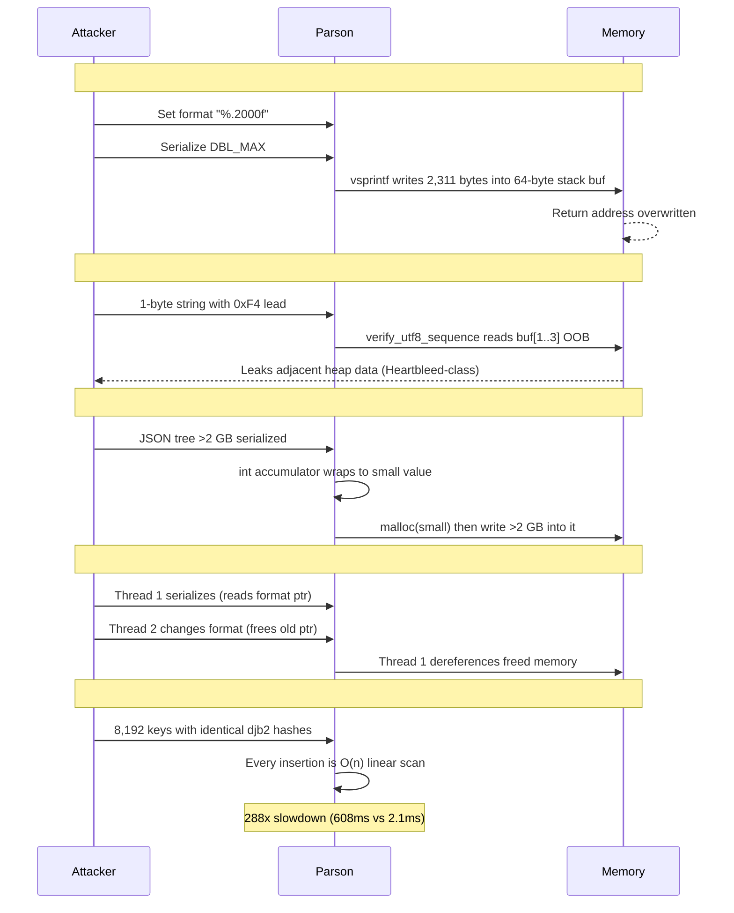
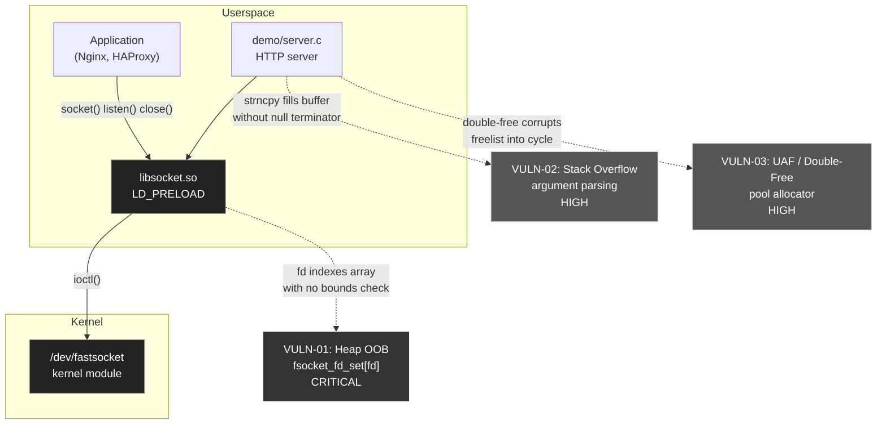
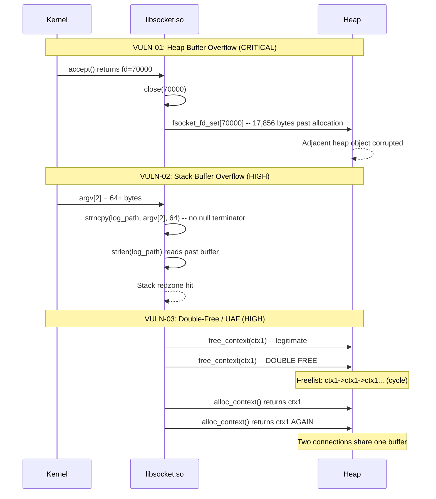

# Low-Level Research

**Vulnerability discovery in C libraries, kernel modules, and systems software**

Manual source code auditing | Coverage-guided fuzzing | Exploit development

---

---

## Research Portfolio

Original vulnerability research against real-world C codebases. Each finding includes vulnerable source code, a working proof-of-concept, root cause analysis, and remediation guidance.

| Target | Domain | Method | Findings | Severity | Writeup |
|--------|--------|--------|----------|----------|---------|
| **Parson v1.5.3** | C JSON parser (2,487 LOC) | Manual source audit | 14 vulnerabilities, 9 CWE classes | 4 HIGH / 7 MEDIUM / 3 LOW | [Full Report](vulnerabilities/parson/) |
| **Fastsocket** | Linux kernel socket library (SINA Corp) | AFL++ fuzzing + ASan | 3 vulnerabilities, 24 crash inputs | 1 CRITICAL / 2 HIGH | [Full Report](vulnerabilities/fastsocket/) |

---

## Parson v1.5.3 -- 14 Vulnerabilities in a C JSON Parser

**Target:** [parson.c](https://github.com/kgabis/parson) -- lightweight single-file JSON library
**Method:** Manual source code audit of all 2,487 lines
**Date:** September 2026

### Attack Surface

```mermaid
graph TD
    subgraph "Public API Entry Points"
        PARSE["json_parse_string()<br/>json_parse_file()"]
        SERIAL["json_serialize_to_string()"]
        BUILD["json_value_init_*()<br/>json_object_set_*()"]
        CONFIG["json_set_float_serialization_format()<br/>json_set_number_serialization_function()"]
        OPS["json_value_deep_copy()<br/>json_validate()<br/>json_value_equals()"]
    end

    PARSE --> UTF8["is_valid_utf8()"]
    PARSE --> HASH["hash_string() djb2"]
    PARSE --> NUM["strtod()"]
    SERIAL --> SPRINTF["parson_sprintf()<br/>vsprintf wrapper"]
    SERIAL --> RECURSE["json_serialize_to_buffer_r()"]
    BUILD --> OPS
    CONFIG --> GLOBALS["Global mutable state<br/>no synchronization"]

    UTF8 -->|"#2 reads 3 bytes OOB"| V2["Heap Over-Read<br/>CWE-125"]
    HASH -->|"#9 deterministic collisions"| V9["HashDoS 288x<br/>CWE-407"]
    NUM -->|"#10 locale-dependent"| V10["Data Corruption<br/>CWE-474"]
    SPRINTF -->|"#1 no bounds on vsprintf"| V1["Stack Overflow<br/>CWE-120"]
    RECURSE -->|"#3 int wraps at 2GB"| V3["Integer Overflow<br/>CWE-190"]
    RECURSE -->|"#5-8 no depth limit"| V5["Stack Exhaustion<br/>CWE-674"]
    GLOBALS -->|"#4 free while reading"| V4["Use-After-Free<br/>CWE-416"]
    CONFIG -->|"#11 no buf size param"| V11["Callback Overflow<br/>CWE-120"]

    style V1 fill:#333,color:#fff,stroke:#fff
    style V2 fill:#333,color:#fff,stroke:#fff
    style V3 fill:#333,color:#fff,stroke:#fff
    style V4 fill:#333,color:#fff,stroke:#fff
    style V5 fill:#555,color:#fff,stroke:#ccc
    style V9 fill:#555,color:#fff,stroke:#ccc
    style V10 fill:#555,color:#fff,stroke:#ccc
    style V11 fill:#555,color:#fff,stroke:#ccc
```

### How Each Vulnerability Works

### Findings Table

| # | Vulnerability | CWE | Impact |
|---|--------------|-----|--------|
| 1 | Stack overflow via `vsprintf` -- no bounds on format output | CWE-120/676 | RCE |
| 2 | Heap over-read in UTF-8 -- reads 3 bytes past allocation | CWE-125 | Info leak |
| 3 | Integer overflow in serialization size -- `int` wraps at 2 GB | CWE-190/122 | Heap overflow |
| 4 | Thread-unsafe globals -- UAF on `parson_float_format` | CWE-362/416 | Corruption |
| 5-8 | Uncontrolled recursion in 4 post-parse functions | CWE-674 | DoS |
| 9 | HashDoS via deterministic djb2 collisions | CWE-407 | DoS |
| 10 | Locale confusion -- `strtod` uses `,` as decimal in some locales | CWE-474 | Data corruption |
| 11 | Callback API gives buffer pointer with no size | CWE-120 | Stack overflow |
| 12-14 | Int truncation, alloc overflow, TOCTOU | CWE-190/367 | Theoretical |

---

## Fastsocket -- 3 Memory Corruption Vulnerabilities in a Kernel Socket Library

**Target:** [fastsocket](https://github.com/fastos/fastsocket) -- SINA Corporation's kernel module + userspace library
**Method:** Coverage-guided fuzzing with AFL++ 5.03c, confirmed via ASan + UBSan
**Date:** September 2026

### Architecture and Attack Surface

### How Each Vulnerability Works

### Fuzzing Results

| Harness | Target | Crashes | Coverage | Verdict |
|---------|--------|---------|----------|---------|
| `fuzz_fdset` | `libsocket.c` -- fd_set array | **8** | 38.89% | **CRITICAL** |
| `fuzz_argparse` | `server.c` -- strncpy/strlen | **11** | 38.98% | **HIGH** |
| `fuzz_context_pool` | `server.c` -- slab allocator | **5** | 25.53% | **HIGH** |
| `fuzz_http_parse` | `server.c` -- HTTP pipeline | 0 | 20.00% | CLEAN |

---

## Books and Resources

| Resource | Description |
|----------|------------|
| [The Art of Exploit Development](books/The_Art_of_Exploit_Development.pdf) | 222-page guide covering the full exploit development pipeline -- from x86/x64 architecture fundamentals through stack and heap exploitation to kernel exploits and fuzzing. |

Book Contents

- **Part I -- Foundations:** Computer architecture, x86/x64 assembly, memory layout, C for exploit devs
- **Part II -- Stack-Based Exploitation:** Buffer overflows, controlling EIP/RIP, shellcode, encoding/evasion, SEH exploits
- **Part III -- Bypassing Protections:** Stack canaries, DEP/NX + ROP, ASLR bypass, PIE/RELRO/FORTIFY_SOURCE
- **Part IV -- Heap Exploitation:** malloc internals, heap overflow, UAF, double free, tcache, heap feng shui
- **Part V -- Format Strings and Integer Bugs:** Format string vulnerabilities, integer overflow/signedness
- **Part VI -- Advanced Topics:** Kernel exploitation, race conditions/TOCTOU, type confusion, sandbox escape, browser exploitation
- **Part VII -- Practical Application:** Fuzzing, pwntools workflows, CTF walkthroughs, real-world case studies, responsible disclosure

---

## Research Methodology

```mermaid
graph LR
    A["1. Select Target<br/>Real-world C code<br/>processing untrusted input"] --> B["2. Map Attack Surface<br/>Public API functions<br/>I/O boundaries"]
    B --> C["3. Find Candidates<br/>Dangerous functions<br/>Missing bounds checks"]
    C --> D["4. Trace Data Flow<br/>Attacker-reachable?<br/>Security-relevant outcome?"]
    D --> E["5. Prove It<br/>Write PoC<br/>Observable failure"]
    E --> F["6. Classify + Report<br/>CWE mapping<br/>Severity + remediation"]

    style A fill:#1a1a1a,color:#fff,stroke:#555
    style B fill:#2a2a2a,color:#fff,stroke:#555
    style C fill:#3a3a3a,color:#fff,stroke:#666
    style D fill:#4a4a4a,color:#fff,stroke:#666
    style E fill:#555,color:#fff,stroke:#777
    style F fill:#666,color:#fff,stroke:#888
```

