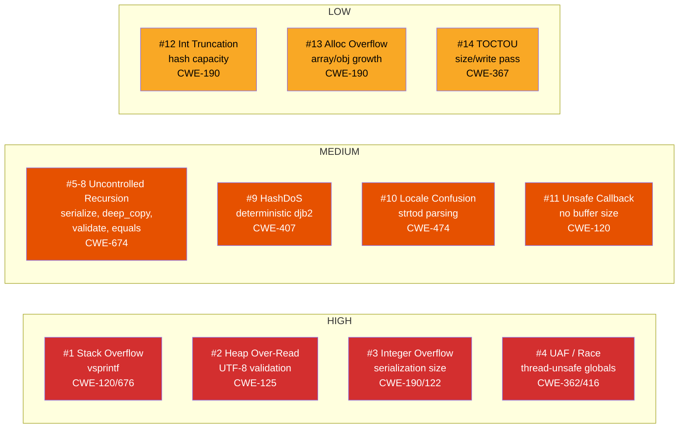
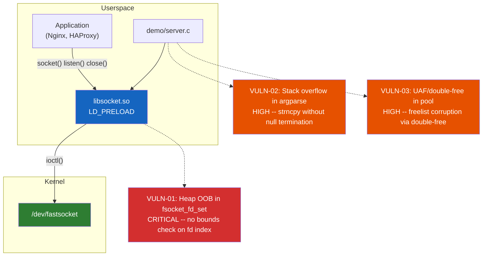
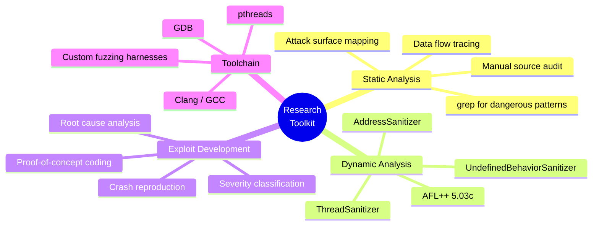
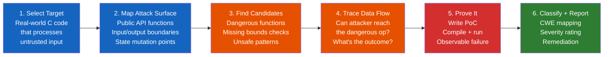

<div align="center">

# Low-Level Research

**Vulnerability discovery in C libraries, kernel modules, and systems software**

<sub>Manual source code auditing | Coverage-guided fuzzing | Exploit development</sub>

---

[]()
[]()
[]()

</div>

---

## Research Portfolio

This repository contains original vulnerability research conducted against real-world C codebases. Each target was selected for its attack surface relevance -- JSON parsers process untrusted input in nearly every web backend, and kernel networking modules run at the highest privilege level on production servers.

Every finding includes the vulnerable source code, a working proof-of-concept, root cause analysis, and remediation guidance.

| Target | Domain | Method | Findings | Severity | Writeup |
|--------|--------|--------|----------|----------|---------|
| **Parson v1.5.3** | C JSON parser (2,487 LOC) | Manual source audit | 14 vulnerabilities, 9 CWE classes | 4 HIGH / 7 MEDIUM / 3 LOW | [Full Report](vulnerabilities/parson/) |
| **Fastsocket** | Linux kernel socket library (SINA Corp) | AFL++ fuzzing + ASan | 3 vulnerabilities, 24 crash inputs | 1 CRITICAL / 2 HIGH | [Full Report](vulnerabilities/fastsocket/) |

---

## Parson v1.5.3 -- 14 Vulnerabilities in a C JSON Parser

**Target:** [parson.c](https://github.com/kgabis/parson) -- lightweight single-file JSON library used in embedded systems and server applications
**Method:** Manual source code audit -- read all 2,487 lines, traced data flow from every public API entry point to dangerous internal operations
**Date:** September 2026

### Vulnerability Summary



### Key Findings

| # | Vulnerability | CWE | What Happens |
|---|--------------|-----|-------------|
| 1 | **Stack buffer overflow** via `vsprintf` | CWE-120/676 | User-controlled format string causes `parson_sprintf` to write 2,311 bytes into a 64-byte stack buffer. Attacker sets format to `"%.2000f"` then serializes `DBL_MAX`. |
| 2 | **Heap over-read** in UTF-8 validation | CWE-125 | `verify_utf8_sequence` reads up to 3 bytes past allocation when given a 4-byte UTF-8 lead in a 1-byte buffer. Same bug class as Heartbleed. |
| 3 | **Integer overflow** in serialization | CWE-190/122 | Size accumulator is `int` (32-bit). JSON >2 GB wraps to small value, causing `malloc` of tiny buffer followed by >2 GB write. |
| 4 | **Use-after-free** via global race | CWE-362/416 | `parson_float_format` is a heap-allocated global with no synchronization. One thread frees it while another dereferences it mid-serialization. Crashed 3/3 runs in <500ms. |
| 5-8 | **Uncontrolled recursion** (4 functions) | CWE-674 | Parser limits depth to 2048, but `serialize`, `deep_copy`, `validate`, and `equals` have no limit. API-built structures bypass the parser limit. 200k-deep nesting causes stack overflow. |
| 9 | **HashDoS** via deterministic djb2 | CWE-407 | Fixed-seed hash allows collision generation. 8,192 colliding keys cause 288x slowdown (608ms vs 2.1ms). |
| 10 | **Locale confusion** via `strtod` | CWE-474 | `strtod` obeys locale settings. Under comma-decimal locales, `[1,5]` silently becomes `[1.5]` (2-element array collapsed to 1). |
| 11 | **Unsafe callback API** | CWE-120 | Number serialization callback receives raw buffer pointer with no size parameter. Buffer is 64 bytes but callback has no way to know. |
| 12-14 | Integer truncation, allocation overflow, TOCTOU | CWE-190/367 | Theoretical issues requiring extreme memory (>100 GB) or race conditions in the two-pass serialization model. |

### Audit Methodology

```
1. Map the attack surface    -- every public function in parson.h
2. grep for dangerous calls  -- vsprintf, strcpy, malloc, recursive calls
3. Trace input to danger     -- can attacker reach the dangerous op?
4. Write a PoC              -- compile, run, observe crash/leak/corruption
5. Classify severity        -- HIGH (RCE path), MEDIUM (DoS/corruption), LOW (theoretical)
```

---

## Fastsocket -- 3 Memory Corruption Vulnerabilities in a Kernel Socket Library

**Target:** [fastsocket](https://github.com/fastos/fastsocket) -- SINA Corporation's kernel module + userspace library for accelerating socket operations on multi-core Linux servers
**Method:** Coverage-guided fuzzing with AFL++ 5.03c, crash confirmation via ASan + UBSan
**Date:** September 2026

### Architecture

Fastsocket intercepts standard socket calls (`socket()`, `listen()`, `close()`, `shutdown()`) via `LD_PRELOAD`, routing them through a kernel module at `/dev/fastsocket`. Any application loaded with the library inherits its vulnerabilities transparently.



### Fuzzing Results

| Harness | Target Code | Crashes | Coverage | Verdict |
|---------|------------|---------|----------|---------|
| `fuzz_fdset` | `libsocket.c` -- fd_set array access | **8** | 38.89% | **CRITICAL** |
| `fuzz_argparse` | `server.c` -- strncpy/strlen parsing | **11** | 38.98% | **HIGH** |
| `fuzz_context_pool` | `server.c` -- slab allocator | **5** | 25.53% | **HIGH** |
| `fuzz_http_parse` | `server.c` -- HTTP read/write | 0 | 20.00% | CLEAN |

### Vulnerability Details

**VULN-01: Heap Buffer Overflow in `fsocket_fd_set` (CRITICAL)**

The library allocates a 65,536-element integer array indexed by file descriptor number. The `listen()`, `close()`, and `shutdown()` wrappers index into this array with the raw `fd` value and **never check bounds**. An fd above 65,536 (reachable when `ulimit -n` is raised or via `dup2()`) writes past the allocation, corrupting adjacent heap objects. The write values are 0 or 1, but the offset is attacker-controlled -- enough for heap metadata corruption.

**VULN-02: Stack Buffer Overflow in Argument Parsing (HIGH)**

The demo server uses `strncpy()` to copy command-line arguments into 64-byte and 32-byte stack buffers. When the source string fills the entire buffer, `strncpy` does not null-terminate. Subsequent `strlen()` and `fopen()` calls read past the buffer into adjacent stack memory. AFL++ found this in 90 seconds -- the crash input is `'o'` followed by 64 bytes, filling `log_path[64]` without a terminator.

**VULN-03: Use-After-Free / Double-Free in Pool Allocator (HIGH)**

The server's custom slab allocator manages connection contexts via a freelist with no double-free protection. Freeing the same context twice creates a cycle in the freelist (`ctx1->next_idx` points to itself). The next two allocations both return the same context -- two connections sharing one buffer. The pool exhaustion guard uses `assert()`, which compiles to nothing in release builds (`-DNDEBUG`). The fuzzer triggered SIGSEGV crashes so severe ASan couldn't intervene.

---

## Books and Resources

| Resource | Description |
|----------|------------|
| [The Art of Exploit Development](books/The_Art_of_Exploit_Development.pdf) | 222-page guide covering the full exploit development pipeline -- from x86/x64 architecture fundamentals through stack and heap exploitation to kernel exploits and fuzzing. |

<details>
<summary>Book Contents</summary>

- **Part I -- Foundations:** Computer architecture, x86/x64 assembly, memory layout, C for exploit devs
- **Part II -- Stack-Based Exploitation:** Buffer overflows, controlling EIP/RIP, shellcode, encoding/evasion, SEH exploits
- **Part III -- Bypassing Protections:** Stack canaries, DEP/NX + ROP, ASLR bypass, PIE/RELRO/FORTIFY_SOURCE
- **Part IV -- Heap Exploitation:** malloc internals, heap overflow, UAF, double free, tcache, heap feng shui
- **Part V -- Format Strings and Integer Bugs:** Format string vulnerabilities, integer overflow/signedness
- **Part VI -- Advanced Topics:** Kernel exploitation, race conditions/TOCTOU, type confusion, sandbox escape, browser exploitation
- **Part VII -- Practical Application:** Fuzzing, pwntools workflows, CTF walkthroughs, real-world case studies, responsible disclosure

</details>

---

## Tools and Techniques Used



---

## Research Methodology

Every target in this repository follows the same framework:



**Static targets** (Parson): full source read, pattern matching for dangerous functions, manual trace from input to crash.

**Dynamic targets** (Fastsocket): extract vulnerable code into harnesses, compile with AFL++ instrumentation + sanitizers, fuzz, triage crashes via ASan reports.

Both approaches produce the same deliverable: reproducible proof that the bug exists, not just a theory that it might.

---

<div align="center">

**Nour Issa** | AIIDA Cybersecurity / Spectra VRG

</div>
