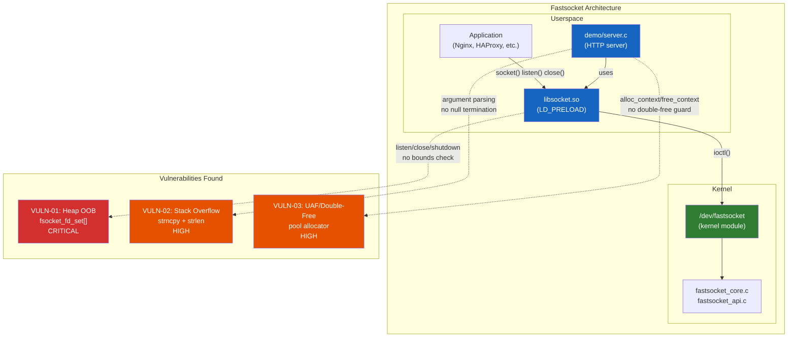
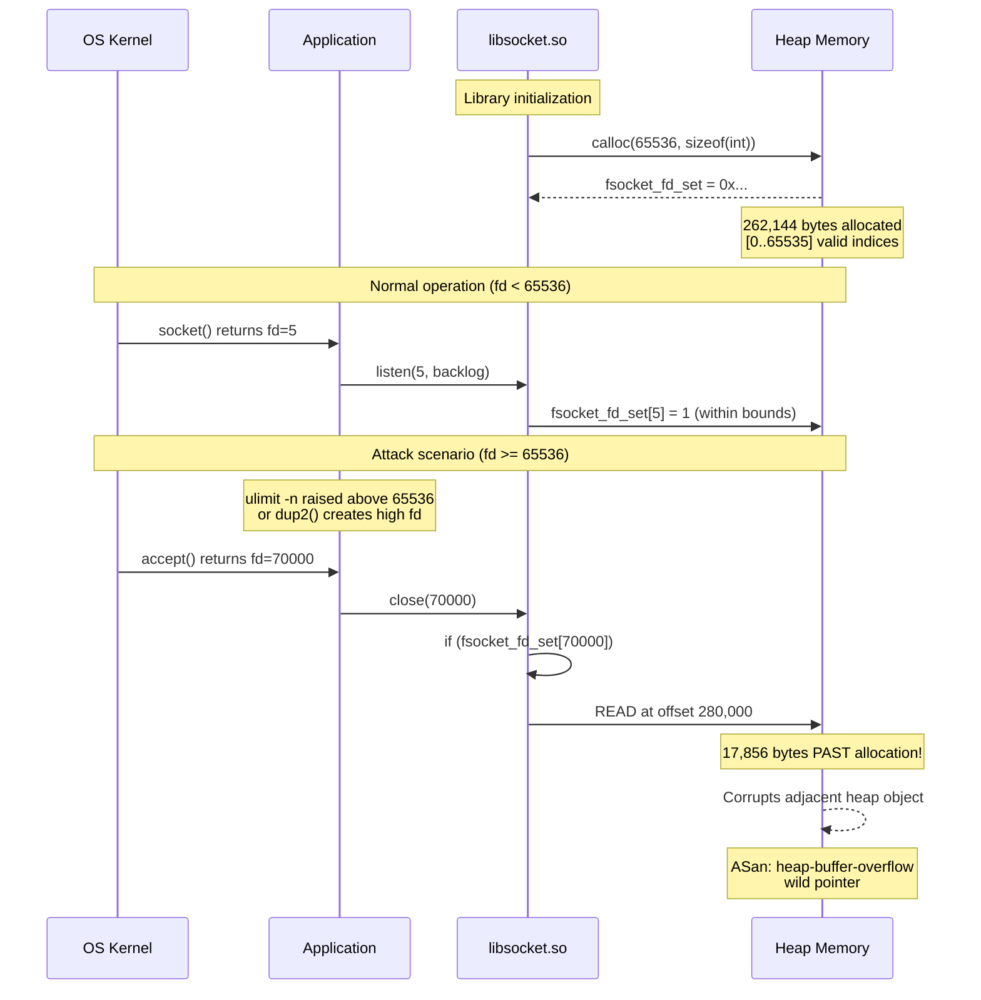
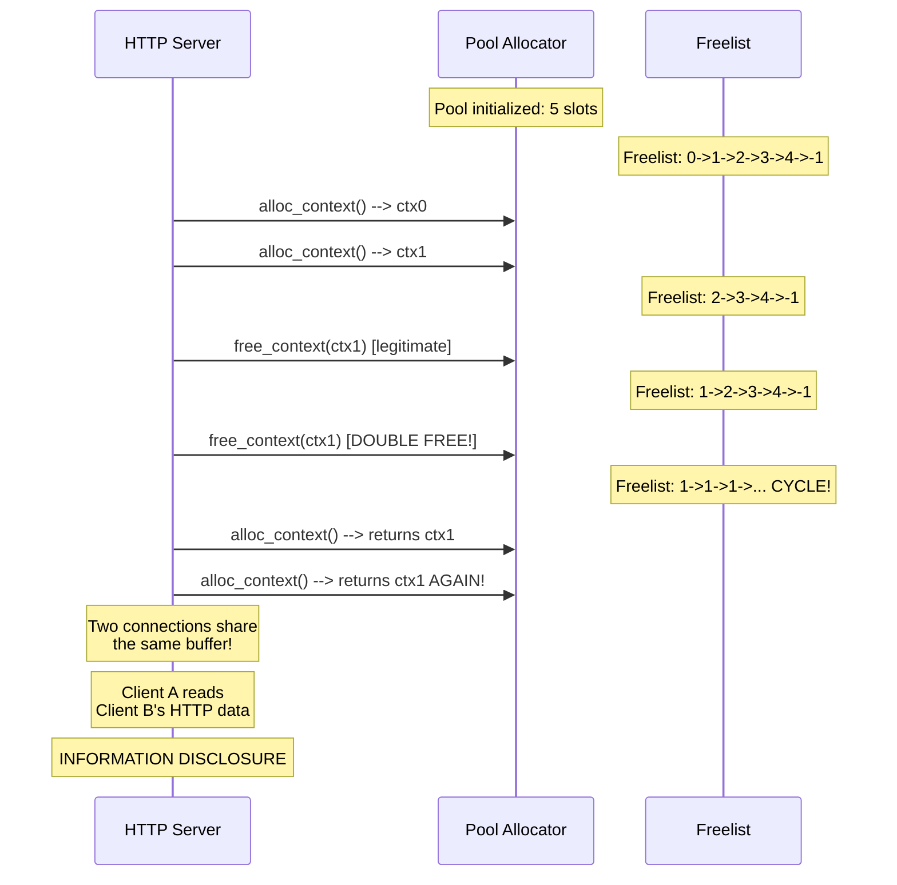
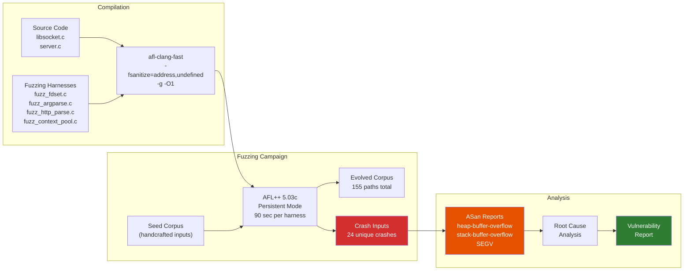

<div align="center">

# Three Memory Corruption Vulnerabilities in Fastsocket

**Fuzzing SINA Corporation's high-performance Linux socket library**

Heap buffer overflow | Stack buffer overflow | Use-after-free / Double-free

1 CRITICAL | 2 HIGH | 24 unique crash inputs

---

**Researcher:** Nour Issa
**Organization:** AIIDA Cybersecurity / Spectra VRG
**Date:** September 2026
**Target:** fastsocket (SINA Corporation)
**Tooling:** AFL++ 5.03c + ASan + UBSan

</div>

---

## Table of Contents

- [Executive Summary](#executive-summary)
- [Background: What is Fastsocket?](#background-what-is-fastsocket)
- [Methodology](#methodology)
  - [Tooling Primer](#tooling-primer)
  - [Fuzzing Campaign Design](#fuzzing-campaign-design)
  - [Harness Architecture](#harness-architecture)
- [Results Summary](#results-summary)
- [Vulnerability Details](#vulnerability-details)
  - [VULN-01: Heap Buffer Overflow in fsocket_fd_set (CRITICAL)](#vuln-01-heap-buffer-overflow-in-fsocket_fd_set)
  - [VULN-02: Stack Buffer Overflow in Argument Parsing (HIGH)](#vuln-02-stack-buffer-overflow-in-argument-parsing)
  - [VULN-03: Use-After-Free / Double-Free in Pool Allocator (HIGH)](#vuln-03-use-after-free--double-free-in-pool-allocator)
- [Architecture Diagram](#architecture-diagram)
- [Vulnerability Flow Diagrams](#vulnerability-flow-diagrams)
- [Fuzzing Pipeline Diagram](#fuzzing-pipeline-diagram)
- [Reproducing Each Bug](#reproducing-each-bug)
- [Reading ASan Reports](#reading-asan-reports)
- [Glossary](#glossary)

---

## Executive Summary

Fastsocket is a kernel module and userspace library created by SINA Corporation (the company behind Weibo) to accelerate socket operations on multi-core Linux servers. It transparently replaces standard `socket()`, `listen()`, `close()`, and `shutdown()` calls via `LD_PRELOAD`, meaning **any application loaded with the library inherits its vulnerabilities without modification**.

This research identified **three distinct vulnerability classes** across the library and its demo server through **automated fuzzing with AFL++ 5.03c**, confirmed by AddressSanitizer (ASan) crash reports. The fuzzing campaign ran four custom harnesses for 90 seconds each, producing **24 unique crash inputs** across three of the four targets.

### Findings Summary

| ID | Vulnerability | Severity | Location | CWE | Crashes |
|----|--------------|----------|----------|-----|---------|
| VULN-01 | Heap buffer overflow in `fsocket_fd_set` | **CRITICAL** | `library/libsocket.c:162,168,249,250,271` | CWE-122/787 | 8 |
| VULN-02 | Stack buffer overflow in argument parsing | **HIGH** | `demo/server.c:137,169,194` | CWE-121/120 | 11 |
| VULN-03 | Use-after-free / double-free in pool allocator | **HIGH** | `demo/server.c:458-513` | CWE-416/415 | 5 |

---

## Background: What is Fastsocket?

Fastsocket is a kernel module and userspace library designed for high-traffic web servers like Nginx and HAProxy. It was designed to solve Linux kernel TCP stack scalability bottlenecks beyond 4 CPU cores.

The architecture has two parts:

- **Kernel module** (`/dev/fastsocket`): A character device that provides accelerated socket syscalls via `ioctl()` commands. It bypasses the normal Linux socket path for better per-core scaling.

- **Userspace library** (`libsocket.so`): Loaded via `LD_PRELOAD`, it intercepts libc functions like `socket()`, `listen()`, `close()`, and `shutdown()`. When the kernel module is present, it routes calls through `ioctl()` instead of standard syscalls.

The repository also includes a **demo HTTP server** (`demo/server.c`, 1,211 lines) that exercises fastsocket's features: an epoll-based event loop with forked worker processes, a custom slab allocator (context pool), and both direct and proxy modes.

**The key security implication:** any application using the library via `LD_PRELOAD` has its socket calls transparently replaced. The application doesn't know fastsocket is running. Vulnerabilities in the library affect every application loaded with it.

---

## Methodology

### Tooling Primer

#### AFL++ (American Fuzzy Lop++)

AFL++ is a **coverage-guided fuzzer**:

1. It **feeds random-ish input to your program** -- starting from seed inputs, it mutates them by flipping bits, inserting bytes, and splicing files together.
2. It **watches which code paths execute** via compile-time instrumentation (`afl-clang-fast`), inserting probes at every branch.
3. It **evolves toward deeper coverage** -- each new interesting case (one that reaches a new branch) becomes a starting point for more mutations.
4. When something **crashes, it saves the input** -- that crash file is a deterministic reproducer.

Our harnesses use `__AFL_LOOP(10000)` (persistent mode), which means the target process doesn't restart for every input -- it loops 10,000 times inside a single process. This gets **10-100x more executions per second** than the default fork-based model.

#### AddressSanitizer (ASan)

ASan is a compiler feature (`-fsanitize=address`) that detects memory errors at runtime:

1. **Shadow memory:** ASan maps every 8 bytes of program memory to 1 byte of "shadow" memory, recording whether each byte is safe to access or poisoned.
2. **Redzones:** Between every heap allocation, around every stack variable, and around every global, ASan inserts poisoned padding. Any access to a redzone is caught.
3. **On every memory access:** the compiler inserts a check -- look up the shadow byte, and if it's poisoned, abort with a detailed report.

#### UndefinedBehaviorSanitizer (UBSan)

UBSan (`-fsanitize=undefined`) catches C operations the language spec says are "undefined behavior" -- signed integer overflow, null pointer dereference, misaligned access, shift by negative amount.

Together: **AFL++ discovers inputs that trigger bugs**, **ASan/UBSan catch the exact moment the bug manifests**.

### Fuzzing Campaign Design

Since fastsocket's library talks to a kernel module (`/dev/fastsocket`) that we can't run in our environment, we wrote **harnesses** -- small C programs that extract the vulnerable code patterns from the real source and expose them to AFL++ without needing the kernel.

### Harness Architecture

| Harness | Target Code | What It Simulates |
|---------|------------|-------------------|
| `fuzz_fdset` | `libsocket.c` | The `fsocket_fd_set[]` array accesses in listen/close/shutdown, plus the `expand_fdset` reallocation logic |
| `fuzz_argparse` | `server.c:99-208` | The `strncpy` / `inet_aton` / `sscanf` argument parsing loop |
| `fuzz_http_parse` | `server.c` read/write | The `process_read`/`process_write` buffer pipeline in direct and proxy modes |
| `fuzz_context_pool` | `server.c:458-513` | The `init_pool` / `alloc_context` / `free_context` slab allocator |

Each harness reads binary input from stdin, interprets it as a sequence of `(operation, fd)` pairs, and replays them against the same code that runs in production. The "buggy" functions are **exact copies** of the real code -- no bounds check before indexing `fsocket_fd_set[fd]`.

#### Campaign Parameters

- **Duration:** 90 seconds per harness
- **AFL++ mode:** Persistent mode with deferred forkserver (`__AFL_INIT()` + `__AFL_LOOP(10000)`)
- **Sanitizers:** ASan + UBSan (`-fsanitize=address,undefined`)
- **Seed corpus:** Handcrafted seeds per harness (normal operations + known-bad edge cases)

---

## Results Summary

| Harness | Crashes | Coverage | Corpus | Verdict |
|---------|---------|----------|--------|---------|
| `fuzz_fdset` | **8** | 38.89% | 20 paths | **CRITICAL** |
| `fuzz_argparse` | **11** | 38.98% | 79 paths | **HIGH** |
| `fuzz_context_pool` | **5** | 25.53% | 51 paths | **HIGH** |
| `fuzz_http_parse` | 0 | 20.00% | 5 paths | CLEAN |

All 24 crash signals are **SIGABRT** (ASan terminating the process after detecting a violation) except for the pool crashes, which include **SIGSEGV** (segmentation fault -- the corruption was so bad the program hit an invalid address before ASan could intervene).

---

## Vulnerability Details

### VULN-01: Heap Buffer Overflow in `fsocket_fd_set`

| | |
|---|---|
| **Severity** | CRITICAL |
| **Location** | `library/libsocket.c` -- lines 162, 168, 249, 250, 271 |
| **CWE** | CWE-122 (Heap Buffer Overflow) / CWE-787 (Out-of-Bounds Write) |
| **Impact** | Heap metadata corruption, information disclosure, potential code execution |
| **Crashes** | 8 unique inputs |

#### The Vulnerability in Plain English

When fastsocket's library initializes, it allocates an array of 65,536 integers:

```c
fsocket_fd_set = calloc(INIT_FDSET_NUM, sizeof(int));  // 65536 ints
fsocket_fd_num = INIT_FDSET_NUM;
```

This array tracks which file descriptors are "fastsocket listen sockets." The index into the array is the file descriptor number itself. When you call `listen(fd, ...)`, the library sets `fsocket_fd_set[fd] = 1`. When you call `close(fd)`, it sets `fsocket_fd_set[fd] = 0`.

The problem: **none of these accesses check whether `fd` is within the array bounds.**

#### Vulnerable Code

```c
// library/libsocket.c -- listen()
int listen(int fd, int backlog)
{
    // ...
    if (fsocket_channel_fd >= 0) {
        arg.fd = fd;
        arg.backlog = backlog;

        if (!fsocket_fd_set[fd])         // LINE 162 -- NO BOUNDS CHECK
            fsocket_fd_set[fd] = 1;      // LINE 163 -- HEAP OOB WRITE

        ret = ioctl(fsocket_channel_fd, FSOCKET_IOC_LISTEN, &arg);
        if (ret < 0) {
            FSOCKET_ERR("FSOCKET:Listen failed!\n");
            fsocket_fd_set[fd] = 0;      // LINE 168 -- HEAP OOB WRITE
        }
        // ...
    }
}

// library/libsocket.c -- close()
int close(int fd)
{
    // ...
    if (fsocket_channel_fd >= 0) {
        arg.fd = fd;

        if (fsocket_fd_set[fd])          // LINE 249 -- HEAP OOB READ
            fsocket_fd_set[fd] = 0;      // LINE 250 -- HEAP OOB WRITE

        ret = ioctl(fsocket_channel_fd, FSOCKET_IOC_CLOSE, &arg);
    }
}

// library/libsocket.c -- shutdown()
int shutdown(int fd, int how)
{
    // ...
    if ((fsocket_channel_fd >= 0) && fsocket_fd_set[fd]) {  // LINE 271 -- OOB READ
        arg.fd = fd;
        arg.op.shutdown_op.how = how;
        ret = ioctl(fsocket_channel_fd, FSOCKET_IOC_SHUTDOWN_LISTEN, &arg);
    }
}
```

#### Why `expand_fdset` Doesn't Save You

The library does have a function to grow the array:

```c
int fastsocket_expand_fdset(int fd)
{
    if (fd >= fsocket_fd_num) {
        fsocket_fd_set = calloc(fsocket_fd_num + INIT_FDSET_NUM, sizeof(int));
        // ... memcpy old data, free old, update fsocket_fd_num ...
    }
    return fd;
}
```

But this is only called from `socket()` and `accept()`/`accept4()`. The `listen()`, `close()`, and `shutdown()` wrappers **never call it**. They index directly into the array with whatever `fd` the caller passes.

#### Memory Layout of the Bug

```
Heap memory:

  +-------------------------------------+
  | fsocket_fd_set = calloc(65536, 4)   |
  | [0] [1] [2] ... [65535]             | <-- 262,144 bytes allocated
  +-------------------------------------+
  | ASan redzone (poisoned)             | <-- fa fa fa fa ...
  +-------------------------------------+
  | other heap allocations ...          |
  +-------------------------------------+

  If fd = 70000:
    fsocket_fd_set[70000] = address + (70000 x 4) = 280,000 bytes from start
                                                      |
                                            17,856 bytes PAST the allocation
                                            Lands in redzone or another object
```

#### What an Attacker Gets

The write values are **0 or 1** (not arbitrary), but the offset is controlled by the fd number:

- **Heap OOB write of 0 or 1:** Can corrupt metadata of adjacent heap objects. Even writing a single byte to a malloc chunk header can cause the allocator to return overlapping regions on the next allocation -- a classic heap exploitation primitive.
- **Heap OOB read:** The `if (fsocket_fd_set[fd])` check leaks one bit of information about heap contents at a controlled offset. In a local attack scenario, this enables heap layout probing.

#### How Could This Happen in Practice?

The `fd` value comes from the kernel -- it's whatever file descriptor number the OS returns from `socket()` or `accept()`. Normally these are small numbers. But:

- If `ulimit -n` (the open file limit) is raised above 65,536 after the library initializes, the kernel can return fd numbers beyond the array.
- If `dup2()` or other fd manipulation creates high-numbered descriptors, `close()` will be called with those numbers.
- The server itself sets `RLIMIT_NOFILE` to `MAX_CONNS_PER_WORKER` (8,192) -- well within bounds for normal operation, but nothing prevents a deployment from overriding this.

#### ASan Crash Output

```
==2338064==ERROR: AddressSanitizer: heap-buffer-overflow on address 0x787f827e2900
READ of size 4 at 0x787f827e2900 thread T0
    #0 0x59bfe3e8877d in sim_close_buggy fuzz_fdset.c:109:9
    #1 0x59bfe3e8877d in main fuzz_fdset.c:172:21

Address 0x787f827e2900 is a wild pointer.
SUMMARY: AddressSanitizer: heap-buffer-overflow fuzz_fdset.c:109:9 in sim_close_buggy
```

- `heap-buffer-overflow`: access beyond a heap allocation's bounds
- `READ of size 4`: reading one `int` -- the `if (fsocket_fd_set[fd])` check
- `wild pointer`: the address is so far from any allocation that ASan can't even identify which allocation it relates to
- Shadow bytes all `fa`: every byte around the access is heap redzone -- uncharted territory

#### Suggested Fix

Add bounds checking to every function that accesses `fsocket_fd_set`:

```c
// Before accessing fsocket_fd_set[fd]:
if (fd < 0 || fd >= fsocket_fd_num) {
    // Either return an error, or call fastsocket_expand_fdset(fd) first
    return -1;
}
```

---

### VULN-02: Stack Buffer Overflow in Argument Parsing

| | |
|---|---|
| **Severity** | HIGH |
| **Location** | `demo/server.c` -- lines 137, 169, 194 |
| **CWE** | CWE-121 (Stack Buffer Overflow) / CWE-120 (Buffer Copy without Checking Size) |
| **Impact** | Stack smashing, potential code execution |
| **Crashes** | 11 unique inputs |

#### The Vulnerability in Plain English

The demo server parses command-line arguments using `strncpy()` into fixed-size buffers. The C function `strncpy(dest, src, n)` has a notorious footgun: **if `src` is `n` bytes or longer, the destination is NOT null-terminated.**

Any subsequent string operation on that buffer (`strlen()`, `printf("%s")`, `fopen()`) will read past the end of the buffer looking for the `\0` that isn't there.

#### Vulnerable Code

There are three instances of this pattern:

```c
// demo/server.c -- log path parsing (line 137)
char log_path[64] = {0};   // 64-byte buffer on the stack

// ...
if (argc >= 3 && strcmp(argv[1], "-o") == 0) {
    strncpy(log_path, argv[2], sizeof(log_path));  // NO null terminator if len >= 64
    specified_log_file = 1;
    // ...
}

// Later, at line 357:
log_file = fopen(log_path, "a");  // reads past buffer if not terminated
```

```c
// demo/server.c -- listen address parsing (line 169)
struct listen_addr {
    int param_port;
    struct in_addr listenip;
    char param_ip[32];       // 32-byte buffer
    int listen_fd;
};

// ...
strncpy(la[i].param_ip, argv[2], 32);   // NO null terminator if len >= 32
inet_aton(la[i].param_ip, &la[i].listenip);  // reads unterminated string
```

#### Understanding `strncpy`

```
strncpy(dest, src, n):

Case 1: strlen(src) < n
  src:  [H][e][l][l][o][\0]
  dest: [H][e][l][l][o][\0][\0][\0]...  <-- padded with nulls. Safe.

Case 2: strlen(src) >= n
  src:  [A][A][A][A][A][A][A][A]...[\0]    (64+ bytes)
  dest: [A][A][A][A][A][A][A]...[A][A]     <-- NO null terminator!
                                    ^
                                 64th byte, then what?

  strlen(dest) reads: [A][A]...[A][A][???][???][???]...
                                         ^
                         past the buffer --> stack overflow read
```

#### What the Fuzzer Found

AFL++ generated an input string starting with `o` (selecting the log-path parser) followed by 64+ bytes of data. The `strncpy` filled all 64 bytes of `log_path` without a terminator. When `strlen(log_path)` executed, it read 65 bytes -- one byte into the ASan stack redzone between `log_path` and the next variable.

#### ASan Output

```
==2340838==ERROR: AddressSanitizer: stack-buffer-overflow on address 0x6d14b8e00060
READ of size 65 at 0x6d14b8e00060 thread T0
    #0 ... in strlen
    #1 ... in parse_log_path fuzz_argparse.c:94:27

This frame has 2 object(s):
    [32, 96)  'log_path' (line 90)     <-- 64 bytes, offsets 32-95
    [128, 4224) 'input' (line 104)     <-- the input buffer

Memory access at offset 96 partially underflows 'input'
```

Offset 96 is one byte past `log_path`'s end (95). The `f2` shadow bytes between them are the stack mid-redzone -- ASan's padding between stack variables.

#### The Fix

Always null-terminate after `strncpy`:

```c
strncpy(log_path, argv[2], sizeof(log_path) - 1);
log_path[sizeof(log_path) - 1] = '\0';

// Or better, use snprintf which always null-terminates:
snprintf(log_path, sizeof(log_path), "%s", argv[2]);
```

---

### VULN-03: Use-After-Free / Double-Free in Pool Allocator

| | |
|---|---|
| **Severity** | HIGH |
| **Location** | `demo/server.c` -- lines 458-513 |
| **CWE** | CWE-416 (Use-After-Free) / CWE-415 (Double-Free) |
| **Impact** | Memory corruption, information disclosure, potential code execution |
| **Crashes** | 5 unique inputs (including SIGSEGV -- corruption so severe ASan couldn't intervene) |

#### The Vulnerability in Plain English

The server uses a custom memory allocator called a **slab allocator** (or "pool allocator") for connection contexts. Instead of calling `malloc()` / `free()` for every connection, it pre-allocates a big array of connection structs and manages them through a freelist.

The pool has three bugs:

1. **assert-only bounds check** -- pool exhaustion crashes or corrupts in release builds
2. **no double-free protection** -- freeing the same context twice corrupts the freelist
3. **fd leak in accept loop** -- only one context is allocated for multiple accepted fds

#### How the Pool Allocator Works

```
Pool structure:

pool->arr:  [ctx0] [ctx1] [ctx2] [ctx3] [ctx4] ...
               |      |      |      |      |
next_idx:      1      2      3      4     -1     (freelist chain)

pool->next_idx = 0  (head of freelist)
pool->allocated = 0
pool->total = 5

alloc_context():
  1. Take pool->arr[pool->next_idx]         --> ctx0
  2. Advance: pool->next_idx = ctx0->next_idx --> 1
  3. pool->allocated++

free_context(ctx0):
  1. ctx0->next_idx = pool->next_idx        --> 2
  2. pool->next_idx = (ctx0 - pool->arr)    --> 0
  3. pool->allocated--
  Freelist is now: 0 --> 2 --> 3 --> 4 --> -1
```

#### Bug 1: Double-Free Corrupts the Freelist

```
Starting state (ctx0 and ctx1 allocated, freelist at 2):
  pool->next_idx = 2

free_context(ctx1):           <-- first free, legitimate
  ctx1->next_idx = 2         // ctx1 points to old head
  pool->next_idx = 1         // head now points to ctx1
  Freelist: 1 --> 2 --> 3 --> 4 --> -1

free_context(ctx1):           <-- DOUBLE FREE
  ctx1->next_idx = 1         // ctx1 points to ITSELF!
  pool->next_idx = 1         // head still points to ctx1
  Freelist: 1 --> 1 --> 1 --> ...  <-- INFINITE CYCLE

Next alloc_context():
  Returns ctx1 (pool->arr[1])
  pool->next_idx = ctx1->next_idx = 1  <-- still points to ctx1!

Next alloc_context():
  Returns ctx1 AGAIN             <-- two "different" connections
  sharing the same memory!       <-- USE-AFTER-FREE
```

#### Bug 2: `assert()` Is Not a Security Check

The pool exhaustion guard is `assert(pool->allocated < pool->total)`. The `assert()` macro **compiles to nothing** when you build with `-DNDEBUG` (standard for release/production builds):

```c
// What the developer wrote:
assert(pool->allocated < pool->total);  // "this should never happen"

// What the compiler generates in release:
/* nothing */

// What happens at runtime:
pool->allocated++;       // goes to 8193 (past total of 8192)
ret = &pool->arr[pool->next_idx];
pool->next_idx = pool->arr[pool->next_idx].next_idx;
//               ^^^^^^^^^^^^^^^^^^^^^^^^^^^^^^^^^^
//               next_idx is -1 (end of list), so this reads
//               pool->arr[-1].next_idx -- a NEGATIVE array index
//               which is pointer arithmetic: address BEFORE the array
```

#### Vulnerable Code

```c
// demo/server.c -- alloc_context (line 483)
struct conn_context *alloc_context(struct context_pool *pool)
{
    struct conn_context *ret;

    assert(pool->allocated < pool->total);  // NO-OP in release builds (-DNDEBUG)
    pool->allocated++;

    ret = &pool->arr[pool->next_idx];
    pool->next_idx = pool->arr[pool->next_idx].next_idx;  // follows freelist

    ret->fd = 0;
    ret->fd_added = 0;
    ret->end_fd = 0;
    ret->end_fd_added = 0;
    ret->next_idx = -1;
    ret->pool = pool;

    return ret;
}

// demo/server.c -- free_context (line 504)
void free_context(struct conn_context *context)
{
    struct context_pool *pool = context->pool;

    assert(pool->allocated > 0);  // also a no-op in release

    pool->allocated--;

    context->next_idx = pool->next_idx;
    pool->next_idx = context - pool->arr;  // pointer arithmetic -- assumes context is in the array
}
```

#### What the Fuzzer Found

The crash is a **SIGSEGV** (segmentation fault), not SIGABRT. This means the corruption was so severe that the program tried to dereference an address that doesn't belong to any mapped memory page -- the OS killed it before ASan could even intervene:

```
==2343933==ERROR: AddressSanitizer: SEGV on unknown address 0x7ccee35dfff8
    #0 ... in alloc_context fuzz_context_pool.c:94:48

Register values:
rax = 0x00007ccee35dfff8  <-- the garbage pointer it tried to read
```

The `rax` register holds the address that `alloc_context` tried to dereference at line 94: `pool->next_idx = pool->arr[pool->next_idx].next_idx`. After the double-free corrupted the freelist, `next_idx` became a nonsensical value, and using it as an array index produced an address in unmapped memory.

#### Real-World Impact

In the demo server, each worker process has a pool of `MAX_CONNS_PER_WORKER` (8,192) contexts. Under a connection storm -- an attacker opening and closing thousands of connections rapidly -- the accept/close race can trigger double-frees. The result: **two connections sharing the same context buffer**, meaning one client can read HTTP data intended for another. This is an information disclosure vulnerability.

#### Suggested Fix

1. Replace `assert()` with a proper error check that returns NULL on pool exhaustion
2. Add double-free detection: check `context->next_idx != -1` (only allocated contexts have `next_idx == -1`)
3. Zero the context on free to prevent information disclosure

```c
struct conn_context *alloc_context(struct context_pool *pool)
{
    if (pool->allocated >= pool->total)
        return NULL;  // proper error, not assert
    // ... rest of function
}

void free_context(struct conn_context *context)
{
    if (context->next_idx != -1)
        return;  // already freed -- prevent double-free
    // ... rest of function
}
```

---

## Architecture Diagram



---

## Vulnerability Flow Diagrams

### VULN-01: Heap Buffer Overflow Flow



### VULN-03: Double-Free / Use-After-Free Flow



---

## Fuzzing Pipeline Diagram



---

## Reproducing Each Bug

### Prerequisites

```bash
# Build AFL++ from source (no root needed)
cd /path/to/AFLplusplus
make source-only
export PATH="$(pwd):$PATH"

# Set environment for fuzzing
export AFL_SKIP_CPUFREQ=1
export AFL_I_DONT_CARE_ABOUT_MISSING_CRASHES=1
```

### Building the Harnesses

```bash
cd /path/to/fastsocket

# Compile all four with AFL++ instrumentation + sanitizers
afl-clang-fast -fsanitize=address,undefined -g -O1 -fno-omit-frame-pointer \
    -o fuzzing/fuzz_fdset fuzzing/fuzz_fdset.c

afl-clang-fast -fsanitize=address,undefined -g -O1 -fno-omit-frame-pointer \
    -o fuzzing/fuzz_argparse fuzzing/fuzz_argparse.c

afl-clang-fast -fsanitize=address,undefined -g -O1 -fno-omit-frame-pointer \
    -o fuzzing/fuzz_http_parse fuzzing/fuzz_http_parse.c

afl-clang-fast -fsanitize=address,undefined -g -O1 -fno-omit-frame-pointer \
    -o fuzzing/fuzz_context_pool fuzzing/fuzz_context_pool.c
```

### POC 1: Reproducing the Heap OOB (VULN-01)

```bash
# Replay the crash input that AFL++ found
./fuzzing/fuzz_fdset < fuzzing/out_fdset/default/crashes/id:000000*

# Expected: ASan reports heap-buffer-overflow in sim_close_buggy
# at fuzz_fdset.c:109 -- the fsocket_fd_set[fd] access without bounds check
```

**Manual verification without the fuzzer:**

```python
# Create a minimal PoC: operation 2 (close_buggy) with fd = 2000
# Operation: 0x02 (close_buggy = op % 5 == 2)
# fd: 2000 = 0x000007D0 little-endian = D0 07 00 00
python3 -c "
import struct, sys
# op=2 means sim_close_buggy, fd=2000 which is > 1024 (INIT_FDSET_NUM in harness)
sys.stdout.buffer.write(struct.pack('<Bi', 2, 2000))
" | ./fuzzing/fuzz_fdset
```

### POC 2: Reproducing the Stack Overflow (VULN-02)

```bash
# Replay the AFL++ crash
./fuzzing/fuzz_argparse < fuzzing/out_argparse/default/crashes/id:000000*

# Expected: stack-buffer-overflow in strlen, called from parse_log_path
```

**Manual verification:**

```bash
# Create a minimal PoC: 'o' prefix (log path parser) + 64 bytes of 'A'
python3 -c "print('o' + 'A' * 64)" | ./fuzzing/fuzz_argparse

# You should see: stack-buffer-overflow in strlen
# Because strncpy filled all 64 bytes without a null terminator,
# and strlen reads byte 65 (past the buffer) looking for \0
```

### POC 3: Reproducing the Pool Corruption (VULN-03)

```bash
# Replay the AFL++ crash
./fuzzing/fuzz_context_pool < fuzzing/out_pool/default/crashes/id:000000*

# Expected: SEGV in alloc_context at the next_idx dereference
```

**Manual verification:**

```python
# Create a PoC: small pool (2 slots), alloc, alloc, free-random, free-random, alloc
python3 -c "
import sys
data = bytes([
    0x01,           # pool size seed -> pool size = (1%64)+1 = 2
    0x00,           # op 0: alloc -> slot[0] = ctx0
    0x00,           # op 0: alloc -> slot[1] = ctx1
    0x02,           # op 2: free random -> frees slot[input[i] % slot_count]
    0x02,           # op 2: free random -> may double-free same slot
    0x00,           # op 0: alloc -> follows corrupted freelist -> SEGV
    0x00,           # op 0: alloc -> dereferences garbage next_idx
])
sys.stdout.buffer.write(data)
" | ./fuzzing/fuzz_context_pool

# May need a few attempts since the random-free index depends on the byte value.
# The AFL++ crash files are guaranteed reproducers.
```

### Running the Full Fuzzing Suite

```bash
# Run all harnesses (90 seconds each)
cd /path/to/fastsocket
export PATH="/path/to/AFLplusplus:$PATH"
export AFL_SKIP_CPUFREQ=1
export AFL_I_DONT_CARE_ABOUT_MISSING_CRASHES=1

# Run individually with increased per-execution timeout for ASan overhead
afl-fuzz -t 5000 -i fuzzing/corpus_fdset -o fuzzing/out_fdset -V 90 -- ./fuzzing/fuzz_fdset
afl-fuzz -t 2000 -i fuzzing/corpus_args -o fuzzing/out_argparse -V 90 -- ./fuzzing/fuzz_argparse
afl-fuzz -t 2000 -i fuzzing/corpus_http -o fuzzing/out_http -V 90 -- ./fuzzing/fuzz_http_parse
afl-fuzz -t 2000 -i fuzzing/corpus_args -o fuzzing/out_pool -V 90 -- ./fuzzing/fuzz_context_pool
```

> **Resuming a campaign:** AFL++ supports resuming. If you set `AFL_AUTORESUME=1` and run the same command again, it picks up where it left off. Longer runs (300s+) will find more unique crashes and deeper code paths.

---

## Reading ASan Reports

Every ASan report follows the same structure:

### The Error Line

```
==PID==ERROR: AddressSanitizer: error-type on address 0x... at pc 0x... bp 0x... sp 0x...
```

The **error type** tells you the bug class:

| Error Type | Meaning |
|-----------|---------|
| `heap-buffer-overflow` | read/write past the end of a malloc'd buffer |
| `stack-buffer-overflow` | read/write past the end of a stack variable |
| `heap-use-after-free` | accessing memory that was already `free()`'d |
| `SEGV` | program dereferenced an invalid pointer (corruption too severe for ASan) |
| `double-free` | calling `free()` on the same address twice |

### The Access Description

```
READ of size 4 at 0x787f827e2900 thread T0
```

`READ` vs `WRITE` tells you the direction. The **size** tells you the data type: 4 = `int`, 8 = `pointer` or `long`, 1 = `char`.

### The Stack Trace

```
    #0 0x59bfe3e8877d in sim_close_buggy fuzz_fdset.c:109:9
    #1 0x59bfe3e8877d in main fuzz_fdset.c:172:21
    #2 0x7a6f8362a600 in __libc_start_call_main ...
```

Read bottom-to-top: `main` called the code at line 172, which is inside `sim_close_buggy`. The bad access is at line 109, column 9. **Frame #0 is where the bug is.**

### The Shadow Memory Map

```
Shadow bytes around the buggy address:
  0x787f827e2800: fa fa fa fa fa fa fa fa fa fa fa fa fa fa fa fa
  0x787f827e2880: fa fa fa fa fa fa fa fa fa fa fa fa fa fa fa fa
=>0x787f827e2900:[fa]fa fa fa fa fa fa fa fa fa fa fa fa fa fa fa
```

The `[fa]` with brackets is the exact byte that was accessed. `fa` = heap left redzone. The `=>` marks the row containing the bad access. One shadow byte = 8 application bytes.

> **Pro tip:** When the shadow shows `fd` (freed heap), you have a use-after-free. When it shows `f2` (stack mid redzone), the overflow crossed from one stack variable into the gap before the next one -- the stack frame description will tell you which variables are involved.

---

## Glossary

| Term | Definition |
|------|-----------|
| **Heap** | Memory allocated at runtime via `malloc()` / `calloc()`. Buffer overflows here can corrupt other heap objects or allocator metadata. |
| **Stack** | Memory for local variables inside functions. Fixed layout, grows downward. Overflows here can overwrite return addresses (classic stack smashing). |
| **OOB (Out-of-Bounds)** | Accessing memory outside the bounds of an allocated buffer. Can be a read (information leak) or write (corruption). |
| **UAF (Use-After-Free)** | Accessing memory after it has been freed. The memory may have been reallocated for something else, so you're reading/writing another object's data. |
| **Double-free** | Calling `free()` on the same pointer twice. Corrupts the allocator's internal data structures, often leading to UAF or arbitrary write. |
| **Slab/Pool allocator** | A custom allocator that pre-allocates a fixed array of objects and manages them via a freelist. Avoids `malloc()` overhead but must be carefully managed. |
| **Freelist** | A linked list of available (free) slots in a pool. Each free slot's `next_idx` points to the next free slot. Corruption here means allocations return wrong or overlapping memory. |
| **Redzone** | Poisoned padding bytes that ASan places around allocations. Any access to a redzone is a detected overflow. |
| **Shadow memory** | ASan's metadata: 1 byte of shadow per 8 bytes of real memory. Encodes whether each byte is safe to access. |
| **SIGABRT** | Signal 6. ASan calls `abort()` after detecting a violation. The program terminates with a diagnostic. |
| **SIGSEGV** | Signal 11. The program accessed unmapped memory. Happens when corruption is so severe the program crashes before ASan can intervene. |
| **Coverage-guided fuzzing** | Fuzzing strategy that tracks which code branches each input reaches. Inputs that discover new branches are saved and mutated further, driving the fuzzer toward unexplored code. |
| **Persistent mode** | AFL++ optimization where the target loops inside one process instead of forking per input. 10-100x faster. |
| **LD_PRELOAD** | Linux mechanism to inject a shared library before all others. Fastsocket uses this to replace `socket()` / `close()` / etc. with its own versions -- transparently, without modifying the target application. |
| **strncpy** | C function that copies up to `n` bytes from source to destination. Does NOT null-terminate if the source is `>= n` bytes. A common source of bugs. |
| **assert()** | C macro that aborts if its condition is false -- but ONLY in debug builds. Compiles to nothing with `-DNDEBUG`. Must never be used for security-critical checks. |

---

<div align="center">

Fastsocket Vulnerability Research | Nour Issa | AIIDA Cybersecurity / Spectra VRG

September 2026

3 vulnerabilities | 24 crashes | 1 CRITICAL | 2 HIGH

</div>
